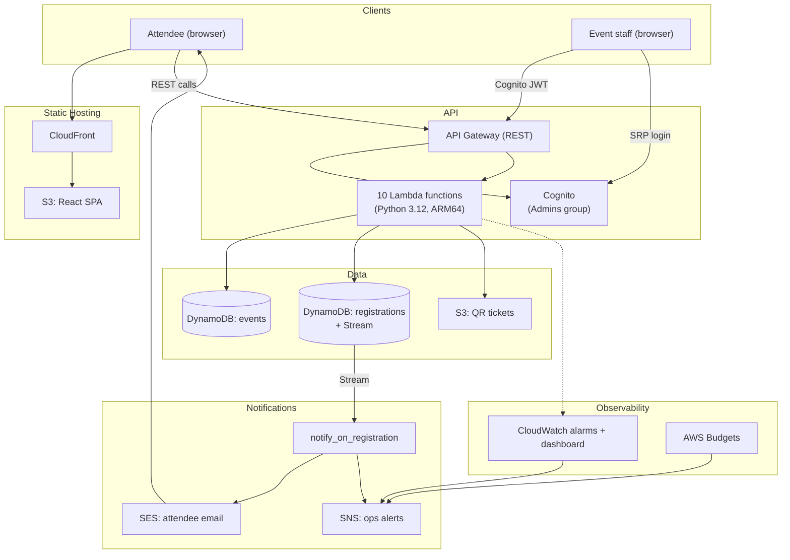

# Event Registration & Ticketing System

A serverless event registration and ticketing system on AWS, replacing a Microsoft
Forms + Excel workflow with a REST API that makes overbooking and duplicate
registration structurally impossible -- not just "unlikely if everyone remembers to
check the spreadsheet first."

Built as a capstone project for the getINNOtized / Azubi Africa AWS training program.
The goal throughout was not just a working app, but a documented reason behind every
architectural choice -- see [`docs/adr/`](docs/adr/) for the decision log.

## The problem

Microsoft Forms has no concept of event capacity. Excel has no concept of a
transaction. Put those together and two people can register for the last seat at the
same instant, both see "success," and nobody finds out until check-in. This system
fixes that at the database layer: a DynamoDB transaction either reserves a seat *and*
prevents a duplicate registration *and* increments the count, all three, or none of
them -- there is no in-between state.

## Architecture at a glance



Full breakdown, including why each service was chosen, in [`docs/architecture.md`](docs/architecture.md).

## Monorepo layout

```
.
├── backend/            Python Lambda functions + shared layers, pytest/moto unit tests
├── infrastructure/     AWS CDK app (Python) -- every stack, CDK assertion tests
├── frontend/           React + TypeScript + Vite SPA (public site + admin dashboard)
├── docs/               Architecture, API reference, data model, deployment, ADRs, diagrams
├── scripts/            bootstrap-admin.sh, deploy.sh
└── .github/workflows/  CI (backend/infra/frontend) + OIDC-based deploy pipeline
```

## Quickstart

```bash
# Backend
cd backend && python3 -m venv .venv && source .venv/bin/activate
pip install -r requirements-dev.txt
pytest                       # 24 unit tests, moto-mocked AWS

# Infrastructure (needs Docker running, for Lambda layer bundling)
cd ../infrastructure && python3 -m venv .venv && source .venv/bin/activate
pip install -r requirements.txt
pip install pytest ruff
pytest                       # CDK assertion tests
cdk synth --all -c adminAlertEmail=you@example.com -c sesSenderEmail=noreply@example.com

# Frontend
cd ../frontend && npm install
npm run build
```

Or, from the repo root, via the [Makefile](Makefile): `make backend-test`,
`make infra-synth`, `make frontend-build`, etc.

To actually deploy to an AWS account, see [`docs/deployment.md`](docs/deployment.md) --
it covers `cdk bootstrap`, the required configuration, SES sandbox verification,
creating the first admin user, and setting up the GitHub Actions OIDC deploy role.

## What's built

- **REST API** (10 Lambda functions, Python 3.12, ARM64) -- public event browsing and
  registration, admin event/registration management, all behind API Gateway with a
  Cognito authorizer on admin routes.
- **DynamoDB** -- two tables, on-demand billing, a transactional design that prevents
  overbooking and duplicate registrations by construction (see
  [ADR-0001](docs/adr/0001-dynamodb-transactional-integrity.md)).
- **QR ticketing** -- generated on registration, stored privately in S3, delivered
  inline in a confirmation email and via short-lived presigned URLs on a ticket page.
- **Notifications** -- SES for attendee confirmation emails, SNS for ops/alarm
  notifications, decoupled from the registration request via a DynamoDB Stream with
  retry + DLQ handling.
- **Cognito authentication** for admins, with a real login flow in the React SPA.
- **CloudWatch alarms + dashboard** tracking request count, error rate (with an alarm
  at >5% over 2-of-3 five-minute periods), Lambda duration, and an explicit
  `RegistrationFailed` application metric.
- **AWS Budgets** cost-threshold alerts, documented alongside the account-level Free
  Tier usage alert preference.
- **CI/CD** -- path-filtered GitHub Actions for backend (pytest/moto), infrastructure
  (`cdk synth` + CDK assertion tests), and frontend (eslint/tsc/build), plus a deploy
  workflow using GitHub OIDC (no long-lived AWS keys).
- **Full documentation** -- architecture, API reference, data model, deployment,
  monitoring runbook, cost breakdown, 6 ADRs, and Mermaid diagrams throughout.

## Documentation index

| Doc | Covers |
|---|---|
| [`docs/architecture.md`](docs/architecture.md) | System diagram, stack breakdown, request flow |
| [`docs/api-reference.md`](docs/api-reference.md) | Every endpoint, request/response shapes, error codes |
| [`docs/data-model.md`](docs/data-model.md) | DynamoDB schema, access patterns, ER diagram |
| [`docs/deployment.md`](docs/deployment.md) | How to actually stand this up, end to end |
| [`docs/monitoring.md`](docs/monitoring.md) | Alarms, dashboard, incident runbook |
| [`docs/cost-and-free-tier.md`](docs/cost-and-free-tier.md) | Expected cost, Free Tier mapping, Budgets |
| [`docs/adr/`](docs/adr/) | The "why" behind every non-obvious decision |
| [`docs/presentation.md`](docs/presentation.md) | Slide deck: problem, architecture, demo, challenges |

## Pushing to GitHub

This repo was initialized locally. To publish it:

```bash
gh repo create event-registration-ticketing --private --source=. --remote=origin
git add -A && git commit -m "Initial commit: serverless event registration and ticketing system"
git push -u origin main
```

Then follow [`docs/deployment.md`](docs/deployment.md#setting-up-github-actions-cicd) to
wire up the OIDC deploy role and repository secrets.
