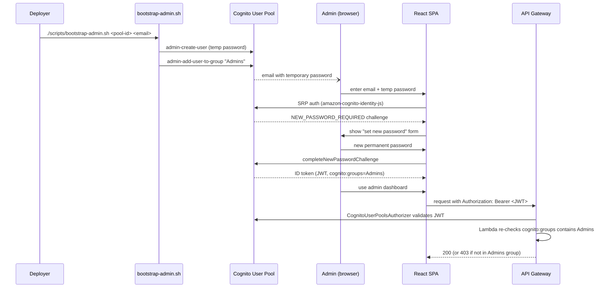

# ADR-0002: Amazon Cognito for Admin Authentication

**Status:** Accepted

## Context

Admin routes (create/edit/delete events, view and cancel registrations) need to be
restricted to event staff. Two realistic options for a project this size:

1. An API Gateway API key + usage plan -- one shared secret, checked at the gateway.
2. Amazon Cognito User Pool -- named accounts, a real login flow, JWT-based
   authorization.

An API key is faster to build and effectively free, but it is a single shared secret:
everyone who needs admin access shares it, it can't be revoked for one person without
breaking it for everyone, and it proves nothing about *who* took an action (no audit
trail).

## Decision

Use a Cognito User Pool. Each admin gets a named account; API Gateway's
`CognitoUserPoolsAuthorizer` validates the JWT on every `/admin/*` request, and each
Lambda handler independently re-checks `cognito:groups` contains `Admins` before doing
anything (`common.auth.require_admin_group` / `is_admin_request`) -- defense in depth,
in case the API Gateway authorizer configuration were ever accidentally loosened.

Self-sign-up is disabled. The only way to become an admin is
`scripts/bootstrap-admin.sh`, which calls `aws cognito-idp admin-create-user` with
`--desired-delivery-mediums EMAIL` -- Cognito generates a temporary password and emails
it directly to the new admin, who is forced into a `NEW_PASSWORD_REQUIRED` challenge on
first sign-in (handled by the SPA's login page, `src/pages/admin/AdminLoginPage.tsx`).
This was a deliberate choice over a CDK custom resource: a custom resource would need to
either generate or receive a password and persist *something* about that credential in
CloudFormation/Lambda state, whereas the script and the CDK stack never see the real
password at all -- only Cognito and the admin's inbox do.

The frontend SPA client has no client secret (a browser cannot keep one) and uses SRP
(Secure Remote Password) authentication, so a password is never transmitted in
plaintext, not even over TLS.

(Source: `docs/diagrams/admin-auth-flow.mmd`.)

## Consequences

- Real per-admin accounts, individually revocable, with actions attributable to a
  specific `sub` (recorded as `createdBy` on events).
- More moving parts than an API key: a User Pool, a client, a group, and a small amount
  of frontend login/session code (`src/context/AuthContext.tsx`).
- One manual bootstrap step is required after every fresh deploy (no admins exist by
  default) -- documented in `docs/deployment.md`.
- If this were to grow into a larger internal tool, the same User Pool could add SSO
  (SAML/OIDC federation) without changing the API authorization model at all.
