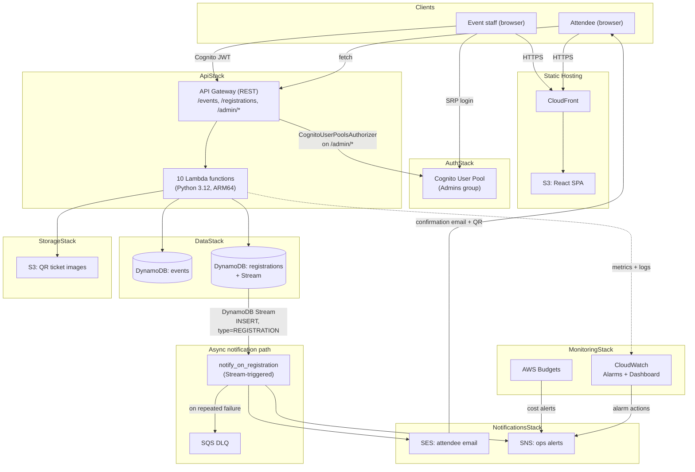
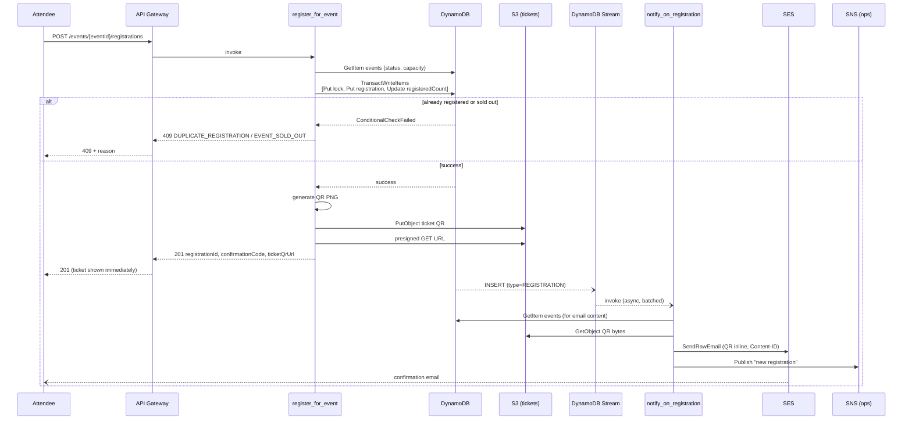

# Architecture

## Problem

Registration and ticketing currently runs on Microsoft Forms + Excel. That works until
two things happen at once: (1) an event gets popular enough that people register
concurrently, and (2) someone needs to know, reliably, how many seats are left right
now. Forms has no concept of capacity; Excel has no concept of a transaction. The
result, in practice, is overbooked events, duplicate registrations nobody notices until
check-in, and no audit trail of who changed what.

This system replaces that with a serverless REST API and a small web app, built so that
overbooking and duplicate registration are prevented by the database itself, not by
someone remembering to check a spreadsheet first.

## System overview

(Source: `docs/diagrams/system-architecture.mmd`.)

## Why each piece is there

| Component | Why this, not something else |
|---|---|
| **API Gateway (REST)** | Matches the specified architecture; gives per-route Cognito authorization and per-stage throttling/logging out of the box. |
| **Lambda, Python 3.12, ARM64** | No servers to patch or size; ARM64 (Graviton) is ~20% cheaper than x86 for the same workload with zero code changes for this project's pure-Python + Pillow dependencies. |
| **DynamoDB, on-demand billing** | Registration traffic is idle-then-bursty; on-demand avoids capacity planning entirely and stays inside the free tier at this scale. `TransactWriteItems` is what actually prevents overbooking -- see [ADR-0001](adr/0001-dynamodb-transactional-integrity.md). |
| **Cognito** | Named, revocable admin accounts with a real login flow, instead of one shared API key -- see [ADR-0002](adr/0002-cognito-admin-auth.md). |
| **SES + SNS (both)** | SES sends the attendee's ticket email (the only AWS service that can email an arbitrary one-off address); SNS carries ops/alarm notifications. Different jobs, different services -- see [ADR-0003](adr/0003-notification-architecture.md). |
| **DynamoDB Streams** | Decouples "reserve the seat" (must be fast and reliable) from "send the email" (can be slow, can retry) -- see [ADR-0003](adr/0003-notification-architecture.md). |
| **S3 (tickets + frontend)** | Private storage for QR images accessed only via short-lived presigned URLs ([ADR-0004](adr/0004-qr-ticket-storage.md)); a private origin behind CloudFront for the SPA, matching the "static hosting" research goal. |
| **CloudWatch + AWS Budgets** | Request count, error rate, and duration are tracked per the stated requirement; Budgets keeps the whole thing inside Free Tier limits with an early warning. |
| **AWS Lambda Powertools** | Structured logs, X-Ray tracing, and EMF custom metrics (`RegistrationSucceeded`/`RegistrationFailed`) without hand-rolled observability code. |

## CDK stacks and deploy order

Seven stacks, one CDK App, wired by passing real construct references between them (not
hardcoded ARNs):

1. `DataStack` -- the two DynamoDB tables + stream.
2. `AuthStack` -- Cognito User Pool, App Client, `Admins` group.
3. `StorageStack` -- private S3 tickets bucket.
4. `NotificationsStack` -- SNS ops topic, SES sender identity.
5. `FrontendStack` -- private S3 + CloudFront (created before `ApiStack` specifically so
   its real CloudFront domain can be injected into Lambda env vars, not a placeholder).
6. `ApiStack` -- depends on 1-5; API Gateway, all ten Lambda functions, the two shared
   Layers, the Cognito authorizer, the DynamoDB Stream event source mapping.
7. `MonitoringStack` -- depends on 6; alarms, dashboard, budget.

## Request flow: registering for an event

(Source: `docs/diagrams/registration-sequence.mmd`.)

## Further reading

- [Data model](data-model.md) -- table schemas, access patterns, the transaction design.
- [API reference](api-reference.md) -- every endpoint, request/response shapes, error codes.
- [Deployment](deployment.md) -- how to actually stand this up.
- [Monitoring](monitoring.md) -- alarms, dashboard, runbook.
- [Cost and Free Tier](cost-and-free-tier.md) -- what this costs, and how that's kept in check.
- [Architecture Decision Records](adr/) -- the "why" behind each non-obvious choice.
