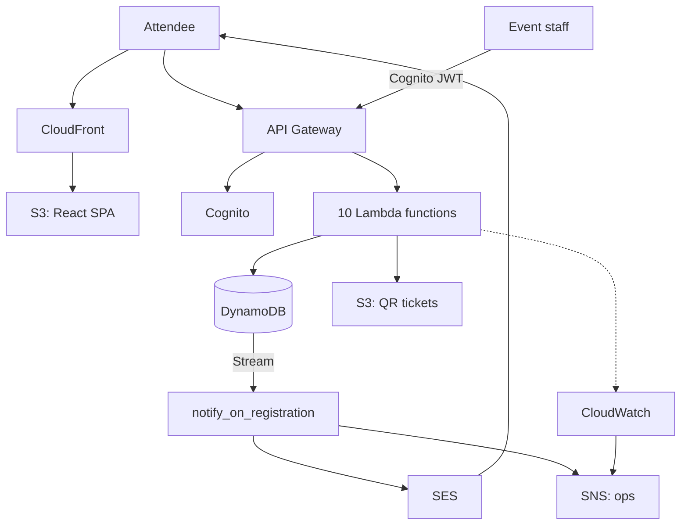
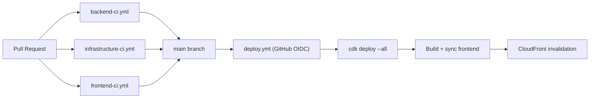

<!--
Render this deck to slides with Marp:
  npx @marp-team/marp-cli docs/presentation.md --pdf
  npx @marp-team/marp-cli docs/presentation.md --pptx
Or install the "Marp for VS Code" extension for a live preview.
Each "---" below marks a new slide.
-->

# Event Registration & Ticketing System

A serverless replacement for Microsoft Forms + Excel

**getINNOtized / Azubi Africa -- AWS Cloud Capstone**

---

## The Problem

Microsoft Forms + Excel is what most small event programs actually run on today.

- **No concept of capacity.** Forms doesn't know an event is full.
- **No concept of a transaction.** Two people can register for the last seat at the
  same instant; both see "success."
- **No audit trail.** Who changed what, and when, is a mystery once the sheet has been
  edited a dozen times.
- **Manual everything.** Confirming registrations, checking for duplicates, and
  emailing attendees are all human steps that don't scale past a handful of events.

---

## The Goal

Not just "replace Excel with a database" -- replace it with a system where **overbooking
and duplicate registration are structurally impossible**, not just unlikely if
everyone remembers to check the spreadsheet first.

And do it serverless, inside the AWS Free Tier, with the reasoning behind every
architectural choice documented -- not just the code.

---

## Architecture

*(Full diagram in `docs/diagrams/system-architecture.mmd`; see `docs/architecture.md`
for the breakdown of every component and why it's there.)*

- **API Gateway (REST) + 10 Lambda functions** (Python 3.12, ARM64)
- **DynamoDB** (2 tables, on-demand billing, transactional writes)
- **Cognito** for admin auth, **SES + SNS** for notifications
- **S3 + CloudFront** for the React SPA, **S3** for QR ticket images
- **CloudWatch + AWS Budgets** for observability and cost control

---

## The Core Idea: One Transaction, Three Guarantees

Registering for an event is a single DynamoDB `TransactWriteItems` call:

1. **Put** a uniqueness lock (`LOCK#eventId#email`) -- blocks duplicate registration.
2. **Put** the registration record itself.
3. **Update** `registeredCount`, conditioned on `< capacity AND status = PUBLISHED` --
   blocks overbooking.

All three succeed together, or all three roll back together. There is no window where
a seat is reserved without the registration existing, or vice versa -- even under a
burst of simultaneous requests for the last seat.

---

## Notifications: Two Services, Two Jobs

- **SES** sends the attendee's confirmation email (with the QR ticket embedded inline)
  -- the correct tool for one-off email to an arbitrary address.
- **SNS** carries ops alerts to the team -- new registrations, CloudWatch alarms.

Decoupled from the registration request via a **DynamoDB Stream**: reserving a seat
never waits on -- or fails because of -- an email provider hiccup. Failed sends retry
automatically and land in a dead-letter queue rather than looping forever or vanishing
silently.

---

## Admin Auth: Cognito, Not a Shared Secret

- Named, individually revocable admin accounts (not one API key everyone shares).
- SRP login flow in the React SPA -- passwords never cross the wire in plaintext.
- Every admin Lambda re-checks group membership in code, in addition to the API
  Gateway authorizer -- defense in depth.
- New admins are provisioned via a documented script, never through a public
  sign-up form.

---

## Observability

- **Structured JSON logs + X-Ray tracing** on every function (AWS Lambda Powertools).
- **Custom EMF metrics**: `RegistrationSucceeded`, `RegistrationFailed{reason}` --
  answers "why are people failing to register?" directly, not just "something 500'd."
- **~25 CloudWatch alarms**: API error rate (tuned to avoid false alarms at low
  traffic), per-function errors/duration, DynamoDB throttling, registration failure
  spikes -- all routed to the ops SNS topic.
- **One dashboard**, request volume through registration outcomes, in one view.

---

## CI/CD

*(Full diagram in `docs/diagrams/ci-cd-pipeline.mmd`.)*

- Three path-filtered CI workflows (backend / infrastructure / frontend) run on every
  PR -- a frontend-only change doesn't trigger a Docker-based CDK synth.
- Deploy runs on every push to `main`, using **GitHub OIDC** -- no long-lived AWS
  access keys stored anywhere.

---

## Challenges Faced

- **DynamoDB's reserved-keyword trap.** `capacity` is a reserved word in condition
  expressions -- caught immediately by a failing unit test, fixed with an
  `ExpressionAttributeNames` alias.
- **The "cancel didn't release the lock" bug.** An early design let a cancelled
  attendee never register again, because the uniqueness lock item was never cleaned
  up. Caught in a design review pass *before* writing code, fixed by making cancel a
  three-item transaction that mirrors registration.
- **cdk-nag's jsii incompatibility** with the current `aws-cdk-lib` release surfaced a
  real cross-library version-skew bug, not a config mistake (reproduced identically at
  cdk-nag's own declared minimum supported CDK version). Documented as a known
  limitation with a manual IAM-wildcard test as the interim safeguard, rather than
  silently disabling the check.
- **SES sandbox mode** means real attendee emails don't "just work" on a fresh
  account -- documented as an explicit, unavoidable manual step rather than a bug.

---

## Live Demo Script

1. Browse published events (public, no login) -- `/`
2. Register for an event -- see the confirmation code + QR ticket immediately.
3. Open the confirmation email -- QR embedded inline.
4. Try registering again with the same email -- `409 DUPLICATE_REGISTRATION`.
5. Admin login (`/admin/login`) -- SRP flow, first-login "set new password."
6. Create a new event, publish it, view the registrant list.
7. Cancel a registration as admin -- capacity frees up immediately.
8. Show the CloudWatch dashboard and one alarm definition.

---

## Cost

Every service used has a **perpetual** Free Tier allotment. At this project's traffic
pattern (idle between events, bursty during registration windows), the only line item
likely to exceed Free Tier is CloudWatch alarms (~25 defined vs. 10 free) -- on the
order of **$1-2/month**. An AWS Budget with email alerts at 80% actual / 100%
forecasted spend is provisioned as a guardrail. See `docs/cost-and-free-tier.md`.

---

## Future Work

- Custom domain + ACM certificate for the frontend and API.
- Multi-environment (staging/prod) stack promotion.
- Re-enable cdk-nag once its jsii assembly catches up with current `aws-cdk-lib`.
- SES production access request, for real (non-sandbox) attendee email delivery.
- Rate limiting beyond API Gateway's default throttle settings.

---

## Thank You

Repository: see `README.md` for the full monorepo layout, quickstart, and links to
every doc referenced in this deck.
